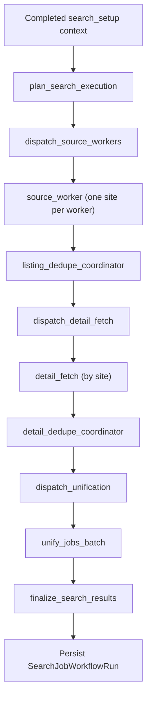

<!-- @import "[TOC]" {cmd="toc" depthFrom=1 depthTo=6 orderedList=false} -->
# Search Job MVP

## Overview

`search_job` now runs as a staged funnel instead of a source-stage LLM agent loop:

1. `plan_search_execution`
2. `dispatch_source_workers`
3. `source_worker`
4. `listing_dedupe`
5. `dispatch_detail_fetch`
6. `detail_fetch`
7. `detail_dedupe`
8. `dispatch_unification`
9. `unify_jobs_batch`
10. `finalize_search_results`

The main product goal is:

- collect jobs from multiple sites in parallel
- reduce duplicates before expensive work
- fetch details only for a shortlist
- use LLM only for planning and ranking/explanations

## Architecture



## Dedupe Layers

Both listing-level and detail-level dedupe use the same staged pattern:

1. exact URL dedupe
2. normalized fingerprint dedupe
3. embedding similarity dedupe

Embedding dedupe is intentionally lightweight:

- batched Gemini embeddings
- no vector database
- top-k comparison against already accepted candidates
- merge only when semantic similarity and lexical guardrails both agree

Guardrails include:

- company similarity
- title similarity
- location compatibility

If embeddings fail, the run falls back to exact + fingerprint dedupe and continues.

## Runtime Notes

`search_setup` runtime now self-heals stale LangGraph Postgres checkpointer connections:

- `invoke_search_setup_graph(...)` retries once on closed-connection `OperationalError`
- `get_search_setup_state(...)` retries once on the same condition
- runtime restart is automatic, no manual app restart required

This was needed because local E2E runs exposed idle/stale checkpointer failures during onboarding resume.

## Local Runbook

### 1. Generate synthetic PDF resumes

```bash
PYTHONPATH=. ./.venv/bin/python scripts/generate_search_job_test_resumes.py
```

Generated files:

- `tmp/search-job-e2e/senior_backend_remote.pdf`
- `tmp/search-job-e2e/latam_fullstack_product.pdf`
- `tmp/search-job-e2e/cis_platform_backend.pdf`

### 2. Start API

```bash
./.venv/bin/uvicorn src.main:app --host 127.0.0.1 --port 8001
```

### 3. Start ARQ worker

For local testing it is safer to run the worker under a simple restart loop because the remote Redis connection may occasionally reset:

```bash
while true; do
  ./.venv/bin/arq src.extensions.arq.WorkerSettings
  echo "worker exited, restarting in 2s"
  sleep 2
done
```

### 4. Run E2E scenarios

```bash
PYTHONUNBUFFERED=1 PYTHONPATH=. ./.venv/bin/python scripts/run_search_job_e2e.py --scenario senior_backend_remote
PYTHONUNBUFFERED=1 PYTHONPATH=. ./.venv/bin/python scripts/run_search_job_e2e.py --scenario latam_fullstack_product
PYTHONUNBUFFERED=1 PYTHONPATH=. ./.venv/bin/python scripts/run_search_job_e2e.py --scenario cis_platform_backend
```

The runner does:

- create a user
- upload a PDF to `/extraction/cv/run`
- poll extraction
- drive onboarding clarification via `/onboarding/users/{user_id}/respond`
- confirm the generated search plan
- poll `/search-jobs/run/{workflow_run_id}`
- print top jobs and site-level counts

## Endpoint Sequence

If you want to replay manually without the helper script, call endpoints in this order.

### Create user

`POST /users`

Example body:

```json
{
  "email": "e2e@example.com",
  "full_name": "E2E User",
  "timezone": "Asia/Bishkek",
  "locale": "en"
}
```

### Upload CV and start extraction

`POST /extraction/cv/run`

Multipart fields:

- `user_id`
- `file`

### Poll extraction run

`GET /extraction/cv/run/{workflow_run_id}`

Wait until status leaves `queued` / `extracting`.

### Inspect onboarding state

`GET /onboarding/users/{user_id}/active`

### Advance or answer onboarding

- `POST /onboarding/users/{user_id}/run`
- `POST /onboarding/users/{user_id}/respond`

Example answer body:

```json
{
  "answer": "yes"
}
```

### Poll search job run

`GET /search-jobs/run/{workflow_run_id}`

The current UI/API path usually auto-enqueues the search run after onboarding confirmation.

## Observed E2E Results

### Scenario: `senior_backend_remote`

Observed result:

- onboarding completed successfully
- search run completed
- `17` unified jobs returned
- strongest sources: `hh`, `getonbrd`, `habr_career`, `indeed`
- best result looked reasonable: `Senior Backend Engineer (Python)` on `hh`

Main caveat:

- many jobs lacked salary data, so the hard salary constraint remained partially unverifiable

### Scenario: `latam_fullstack_product`

Observed result:

- onboarding completed successfully
- search run completed
- `15` unified jobs returned
- `listing_dedupe` kept `24` of `111` listing candidates
- `detail_dedupe` kept `15` of `24` detailed jobs

Main caveat:

- most final jobs still came from `hh` / `habr_career`
- `computrabajo` contributed no selected jobs
- only one `getonbrd` job survived
- many ranked jobs were low-fit because of geography, salary, or role mismatch

Interpretation:

- the funnel mechanics worked
- source selection and geo-aware prioritization still need improvement for LATAM users

### Scenario: `cis_platform_backend`

Observed result:

- extraction quality was good
- onboarding prompts were valid
- the local auto-runner initially needed extra Russian visa-keyword handling to answer prompts correctly

Interpretation:

- backend flow is usable
- multilingual automation around clarification prompts still needs broader keyword coverage for unattended test harnesses

## Current Known Risks

- `Indeed` registration depends on optional dependency availability in the runtime environment.
- Remote Redis resets can kill a local ARQ worker process unless it is supervised.
- Source selection is still not sufficiently geo-aware for some profiles.
- Some completed runs may still surface legacy-looking per-site notes; if that appears again, verify that the worker was restarted on the latest code and inspect the persisted `site_results` payload for drift.
